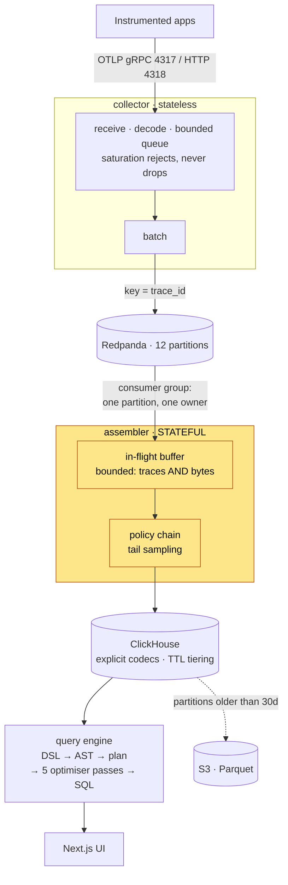

<div align="center">

# TraceLens

**An OpenTelemetry-compatible observability platform — built from the storage engine up.**

OTLP ingestion · tail-based sampling · columnar storage with hand-tuned codecs · a hand-written query language, planner and optimiser · trace waterfalls, flamegraphs and service maps

[](https://github.com/satyamsipah/tracelens/actions/workflows/ci.yml)
[](go.mod)
[](internal/storage/migrations)
[](LICENSE)

[Architecture](docs/ARCHITECTURE.md) · [Query language](docs/QUERY-LANGUAGE.md) · [Benchmarks](docs/BENCHMARKS.md) · [Runbook](docs/RUNBOOK.md) · [Decisions](docs/DECISIONS.md)

</div>

---

## The problem

Distributed tracing produces far more data than anyone can afford to store,
and the interesting traces — the slow ones, the failing ones — are a
vanishing fraction of it. Head-based sampling decides before it knows
anything, so it throws away exactly those. TraceLens keeps the whole trace in
memory until it can decide with the evidence in hand, stores what survives in
columnar layout with per-column codecs chosen from measurement rather than
habit, and answers questions about it in a query language small enough to
learn in five minutes.

**Live demo:** not yet deployed. Every config is written and validated —
`fly.toml` per service, a Helm chart, a tag-triggered GitHub Actions
pipeline — see [docs/DEPLOYMENT.md](docs/DEPLOYMENT.md) for the step-by-step.

---

## Quickstart

Requires Docker and Go 1.25+.

```bash
git clone https://github.com/satyamsipah/tracelens && cd tracelens
make up
open http://localhost:3001
```

That builds every binary and image, starts ClickHouse, Redpanda, the
collector, assembler, query API, web UI, four instrumented demo services,
Prometheus and Grafana, and waits for health checks. The demo gateway
self-drives at 5 rps, so **traces are flowing before the browser opens** — an
empty observability tool demonstrates nothing.

Start at `/query` and turn on the **EXPLAIN** toggle. Watching a plan go
through five optimiser passes into real ClickHouse SQL is the fastest way to
see what this project actually is.

| | |
|---|---|
| Web UI | `localhost:3001` |
| Query API | `localhost:8080` |
| OTLP | `localhost:4317` (gRPC), `localhost:4318` (HTTP) |
| Grafana | `localhost:3000` |
| Prometheus | `localhost:9090` |

```bash
make spans        # confirm telemetry is landing
make compression  # measured compression ratio per table
make loadgen RATE=5000 DURATION=30s
make down
```

---

## Architecture



The highlighted box is the only stateful component, and nearly every awkward
decision in this system exists to serve it. Full walkthrough with sequence
diagrams for the ingest, sampling and query paths:
**[docs/ARCHITECTURE.md](docs/ARCHITECTURE.md)**.

---

## Design decisions

The reasoning behind each, plus what was rejected, is in
[docs/DECISIONS.md](docs/DECISIONS.md).

### Spans are partitioned by `trace_id`. Never round-robin.

The tail sampler holds a trace in memory until it can decide. That only works
if every span of a trace reaches the same instance — which comes from Kafka
keying, not from anything Kubernetes does. Round-robin instead, and each
instance sees a fragment: it drops a failing trace because it never saw the
`ERROR` span, and every fragment carries its own sampling weight, so
aggregates double-count.

**Nothing looks broken when this breaks.** Ingestion succeeds, rows land,
dashboards populate — only the sampling decisions are quietly wrong. So the
producer treats a keyless record as a hard error rather than falling back,
and the Helm chart ships **no Service for the assembler**, making the mistake
structurally unavailable rather than merely documented.

### Saturation rejects. It does not drop.

The bounded queue answers `RESOURCE_EXHAUSTED` (gRPC) / `429 + Retry-After`
(HTTP). Both are retryable per the OTLP spec, so a conforming exporter backs
off and resends — under transient pressure nothing is lost, only deferred.
Rejection is whole-request: admitting a prefix would hand the assembler a
truncated trace while the client believes it delivered a complete one.

### Buffer eviction forces a decision instead of discarding.

At capacity, the oldest trace goes through the policy chain immediately on
whatever spans it has. A discarded trace under load is indistinguishable from
one that was never sampled; a forced decision produces a real row *and*
increments `tracelens_forced_decisions_total`, so degradation is visible.

### Every aggregate carries its sampling weight.

`count` compiles to `sum(sampling_weight)`, never `count(*)`. Percentiles use
`quantileTDigestWeighted`. `min`/`max` are deliberately **not** reweighted —
sampling makes the true extreme less likely to have been observed at all, and
no formula recovers a value you never saw. That limitation is documented
rather than papered over.

### Every column declares a codec, chosen from measurement.

`span_id` is stored with **`CODEC(NONE)`** because ZSTD measured *inflating*
it (0.9995×) — CSPRNG output with no cross-row repetition. A skip index on
`duration_ns` was **removed** after `EXPLAIN indexes=1` showed it pruning 0
of 38 granules. A test fails CI if any column lacks a codec.

### The query planner is the project.

No parser generator, no query library. A hand-written lexer and
recursive-descent parser with line/column-accurate errors, a logical plan,
five optimiser passes each with an ablation test proving it changes the
generated SQL, and a physical compiler where **every identifier comes from a
fixed allow-list and every value is a bound parameter**.

---

## Benchmarks

Full methodology, every table, and the caveats — including what ran under
contention and what did not reach its target scale — are in
**[docs/BENCHMARKS.md](docs/BENCHMARKS.md)**. One command reproduces all of
it against a running stack:

```bash
make bench-all
```

| Measurement | Result | How |
|---|---|---|
| Partition pruning — bytes read | **19.3× fewer** | `make querybench`, ~25M rows |
| Partition pruning — latency | **5.1× faster** (6.44s → 1.26s) | `make querybench`, ~25M rows |
| ClickHouse insert throughput | **1.78M rows/sec** (200k batches) | `make storagebench` |
| Span compression ratio | **4.0×** (143.7 MiB → 36.0 MiB) | `make compression`, 905k live spans |
| Timestamp codec vs none | **~230× smaller** | `make storagebench` |
| Log templating throughput | **~897,000 lines/sec** | `go test -bench ./internal/logs` |
| Log storage saving | **2.76×** vs raw bodies | `internal/logs/store_test.go` |
| Anomaly detector | **precision 0.806 / recall 0.833** | `internal/anomaly/detector_test.go` |
| Error retention under sampling | **100%** (200/200); non-errors 5.0% vs 5% target | `internal/sampling` |
| Ingest hot path | **1 alloc/op**, constant per request | `make bench` |

**On methodology.** These are single-machine numbers on an Apple M1, not
cluster benchmarks, and they are reported as measured. Two things this table
deliberately does *not* claim: per-pass numbers for predicate and limit
pushdown at ~25M rows (both ran concurrently with a background reseed and
showed the pass making queries *slower* — structurally impossible, so flagged
as contention noise rather than published), and a full 100M-row measurement
(seeding is bottlenecked by Go-side row generation at ~12–17k rows/sec, which
made 100M a multi-hour operation that did not finish in-session; the clean
10M-row table stands as the trustworthy baseline).

A benchmark that disagrees with physics is a broken benchmark, not a result.

---

## Query language

```
{service="checkout", status=error} | duration > 500ms | p95(duration) by (operation)
```

Label selectors (`=`, `!=`, `=~`, `!~`), numeric filters with duration units,
time ranges (`since 1h`, `range(now-6h, now-1h)`, defaulting to the last
hour), aggregations (`count`, `sum`, `avg`, `min`, `max`, `p50`/`p95`/`p99`,
several at once), `by (...)`, `sort by`, `limit`, and a `trace("<id>")`
point-lookup that bypasses the planner for the `trace_id` bloom index.

Parse errors point at the exact column:

```
query:1:29: unexpected "error", expected a quoted string
```

Full reference, grammar, and the sampling semantics of each aggregate:
**[docs/QUERY-LANGUAGE.md](docs/QUERY-LANGUAGE.md)**. Every example in that
document is covered by a test that parses it.

---

## What this does NOT do, and why

Being explicit about the edges is more useful than implying there are none.

| Not implemented | Why |
|---|---|
| **Histogram bucket storage** | The metrics schema has one `Float64 value`, which cannot hold bucket bounds. Histograms decompose into `_count`/`_sum`, so quantile queries over histograms are unanswerable. A real fix is a separate bucket table, not a bigger column. |
| **OTLP/JSON** | Protobuf only. JSON is optional in the spec; a JSON request gets `415` rather than a silent misparse. |
| **Multi-tenancy** | No tenant isolation, per-tenant quotas, or authentication on the query API. Adding it properly means a tenant dimension in every sort key, not a `WHERE` clause bolted on. |
| **Trace-to-metrics exemplars** | Logs correlate to traces; metrics do not. |
| **Distributed ClickHouse** | Single-node. The schema uses `MergeTree`, not `ReplicatedMergeTree`, so there is no replication or sharding story yet. See [100x](#what-id-do-differently-at-100x-scale). |
| **Cross-instance consistent hashing** | `internal/sampling/router.go` implements rendezvous hashing and is tested, but is **not wired into the live path** — the Kafka consumer group is what partitions trace ownership today. |
| **Stable `template_id` across restarts** | Template IDs are process-scoped, so a restart can assign different IDs to the same template shape. A shared allocator is the fix. |
| **Full critical-path analysis** | The waterfall's critical path follows the latest-ending child at each level. Real gap-accounting analysis is more than that. |
| **Alerting beyond webhook/Slack** | No PagerDuty, no escalation, no on-call schedules. Not the interesting part of this problem. |

One more, worth its own line because it is a *verification* gap rather than a
feature gap: a live reproduction of `kgo.ErrDataLoss` against a real broker
was attempted and did not succeed — the error needs an already-connected
session with an established leader epoch, not a fresh consumer resuming from
a stale offset. The fix is proven by direct unit tests on the exact code
path; what remains unverified is franz-go calling the callback under a live
truncation event, which is franz-go's own tested behaviour. Written up in
[DECISIONS.md](docs/DECISIONS.md) Phase 5 §3.

---

## What I'd do differently at 100x scale

At roughly 100× this throughput, four things break, in this order:

**1. The assembler's in-memory buffer becomes the binding constraint.** It is
bounded, so it degrades gracefully — but "gracefully" means forced decisions
on partial traces, which is exactly the quality loss tail sampling exists to
prevent. The fix is not a bigger buffer; it is spilling in-flight traces to a
local embedded store (RocksDB/Pebble) keyed by trace_id, keeping only the
decision metadata in RAM. That trades a disk write per span for a buffer
bounded by disk rather than memory.

**2. Twelve Kafka partitions is a ceiling on assembler replicas, and changing
it is a migration.** `hash(key) % N` rehashes every trace_id when N changes,
splitting in-flight traces at cutover — the same failure as round-robin,
once. I would provision a much larger partition count from day one (256, say)
and let consumers own many partitions each, since over-partitioning is cheap
and re-partitioning is not. This is the decision I would most want back.

**3. Single-node ClickHouse.** `ReplicatedMergeTree` behind a `Distributed`
table, sharded by `cityHash64(trace_id)` so a single-trace lookup hits one
shard. That also changes the dedup story: `insert_deduplication_token` works
differently on replicated tables, and the writer's idempotency assumptions
would need re-testing rather than re-reading.

**4. Per-process state that should be global.** The cardinality HyperLogLog
and the Drain template dictionary are both per-assembler-process today, so N
replicas see N independent views of cardinality and allocate N conflicting
template IDs. At 100× that is both wrong and expensive — these need a shared
store (Redis for the sketches, a coordinated allocator for template IDs).

Two smaller ones: consumer lag is a wall-clock proxy rather than genuine
offset lag, which reads wrong right after a backlog drains and would be worth
fixing before anyone autoscales on it; and cold tiering to Parquet would stop
being an operator-run tool and become a scheduled job, because at that volume
the 30-day TTL deletes data someone still wants.

---

## Project structure

| Path | What lives there |
|---|---|
| `cmd/collector` | OTLP receiver → bounded queue → Redpanda |
| `cmd/assembler` | Redpanda → decode → tail sampling → ClickHouse |
| `cmd/query` | Query API, EXPLAIN, service graph, alert evaluator |
| `cmd/coldexport` | Partition → Parquet on S3, with a verified restore path |
| `cmd/migrate`, `cmd/loadgen` | Schema runner, synthetic span generator |
| `cmd/{querybench,storagebench,correctnesscheck}` | Benchmark harnesses |
| `internal/ingest` | OTLP transports, splitting, bounded queue, batching |
| `internal/pipeline` | Kafka producer/consumer, commit-gated offsets |
| `internal/sampling` | Trace buffer, policy chain, router, cardinality guard, watermark |
| `internal/logs` | Drain template extraction and dictionary |
| `internal/query` | Lexer, parser, AST, plan, 5 optimiser passes, SQL compiler |
| `internal/anomaly` | Rolling seasonal z-score with hysteresis |
| `internal/alerting` | YAML rules, dedup, cooldown, webhook/Slack sinks |
| `internal/storage` | Schema, migrations, async writer, cold tiering |
| `internal/observability` | Metrics, admin server, health/readiness |
| `web/` | Next.js 14 UI |
| `demo/` | Four instrumented services in one binary |
| `deploy/` | Compose, Dockerfile, Helm chart, k8s manifests, Fly configs |

---

## Testing

```bash
make test        # unit only, no containers
make test-race   # full suite under -race, real ClickHouse and Redpanda
make bench       # hot-path benchmarks with allocs/op
```

**No mocks for storage or broker behaviour.** Every storage and pipeline test
runs against real containers via Testcontainers, and the ClickHouse container
mounts the *production* `storage.xml`, so the schema under test is
byte-identical to the deployed one. Cold-storage tiering runs against a real
MinIO and asserts that `Enum8`, `Map` and `Array` survive the Parquet round
trip — a row-count check would pass on a restore that silently emptied every
map.

What that buys, concretely: a replayed Kafka batch is proven to be a no-op,
duplicates are proven to collapse under `FINAL`, out-of-order timestamps are
proven to lose nothing, and three real consumer instances against a live
Redpanda are proven never to let one trace_id reach two instances.

The container tests are slow by design. `-short` skips them, and a container
failure on a machine that *has* Docker is a hard failure rather than a skip —
a fully skipped package prints `ok`, and a malformed `storage.xml` once hid
behind exactly that.

`FuzzParser` has run several million executions against the lexer and parser
without a crash. Its job is crash-freedom only; semantic correctness belongs
to table-driven tests, because a fuzzer cannot tell a wrong parse from a
right one.

---

## Documentation

| | |
|---|---|
| [ARCHITECTURE.md](docs/ARCHITECTURE.md) | Component design, sequence diagrams, failure modes |
| [QUERY-LANGUAGE.md](docs/QUERY-LANGUAGE.md) | Full DSL grammar and reference |
| [BENCHMARKS.md](docs/BENCHMARKS.md) | Every measurement, with methodology and caveats |
| [DECISIONS.md](docs/DECISIONS.md) | What was decided, what was rejected, and why |
| [RUNBOOK.md](docs/RUNBOOK.md) | Operating it: alerts, scaling, cold storage, recovery |
| [DEPLOYMENT.md](docs/DEPLOYMENT.md) | VPS, Kubernetes, and the live-demo walkthrough |
| [CONTRIBUTING.md](CONTRIBUTING.md) | Conventions, and what a good PR looks like here |

---

## License

[MIT](LICENSE).
