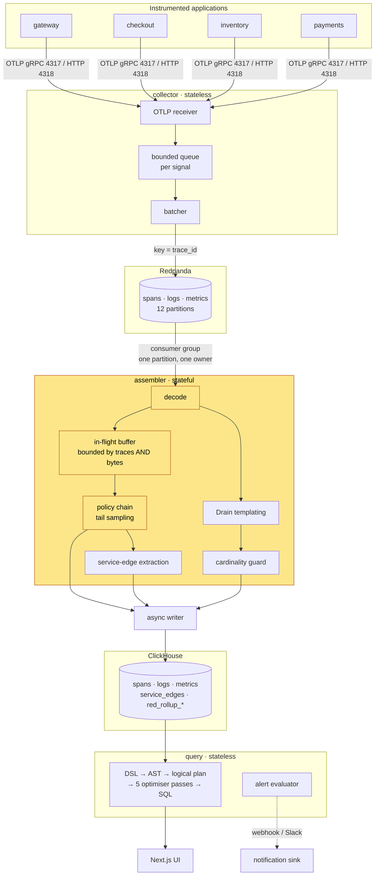
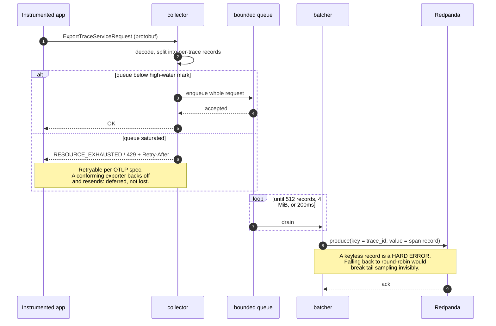
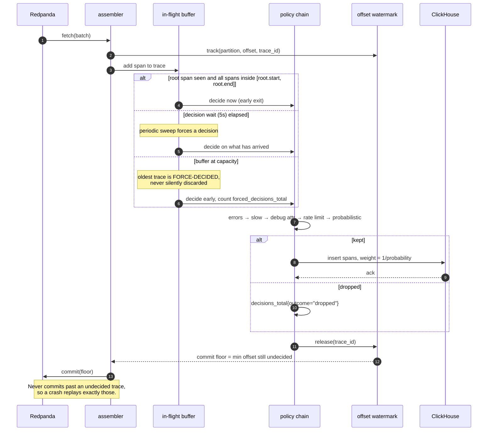
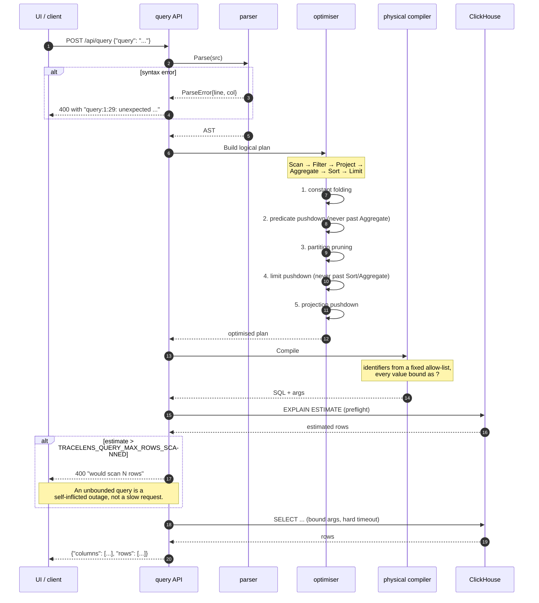

# Architecture

How a span gets from an instrumented process into a query result, and why
each stage is shaped the way it is.

- [Component overview](#component-overview)
- [Path 1: ingest](#path-1-ingest)
- [Path 2: the sampling decision](#path-2-the-sampling-decision)
- [Path 3: a query](#path-3-a-query)
- [Storage](#storage)
- [Log pipeline](#log-pipeline)
- [Derived signals](#derived-signals)
- [Failure modes](#failure-modes)

---

## Component overview

The one stateful box is the assembler, and everything awkward about the
design follows from that.

---

## Path 1: ingest

**Rejection is whole-request.** Admitting a prefix of a batch would hand the
assembler a truncated trace while the client believes it delivered a complete
one — the client has no way to learn which half landed, so the loss would be
real and undetectable. Rejecting the whole thing keeps the retry semantics
honest.

**The key is the raw 16-byte trace_id.** This single line is what makes tail
sampling possible at all: Kafka's partitioner hashes the key, and a consumer
group gives each partition to exactly one member, so every span of a trace
converges on one assembler by construction rather than by coordination.

---

## Path 2: the sampling decision

The assembler cannot decide whether to keep a trace until it has seen enough
of it, and it can never know it has seen *all* of it. Everything here is a
consequence of that.

### Why a fixed wait with an early exit

Three completion heuristics were considered:

| Heuristic | Rejected because |
|---|---|
| Quiet period (reset timer on each new span) | A chatty trace can defer its own decision indefinitely — unbounded buffer residency, which violates principle 2. |
| Root seen + grace | The root span usually arrives *last* (it finishes last), so this collapses to "wait for the slowest span" with no ceiling. |
| **Fixed wait + root-closure early exit** | Chosen. A hard ceiling bounds memory; the early exit means well-formed traces do not pay the full 5s. |

### Why eviction forces a decision instead of discarding

A discarded trace under load is indistinguishable from a trace that was
never sampled — the information that it existed is gone. A forced decision
produces a real row (possibly incomplete) *and* increments
`tracelens_forced_decisions_total`, so the degradation is visible. That is
principle 1 applied to memory pressure.

### The policy chain

Ordered; the first policy that does not abstain wins.

1. `always_sample_errors` — any error span, kept with certainty
2. `always_sample_slow` — over a latency threshold or a rolling p99
3. `attribute_match` — an explicit debug flag; **before** the rate cap, so it
   genuinely bypasses it
4. `rate_limiting` — per-service token bucket. **Abstains** while capacity
   remains and only vetoes once exhausted. An earlier version always resolved
   with a smoothed weight, which silently made policies 3 and 5 dead code.
5. `probabilistic` — the baseline, sampled deterministically by trace_id.
   Must be last: an empty or no-match chain drops rather than silently
   keeping everything.

The file is polled for mtime changes and hot-swapped; a malformed edit is
logged and the previous chain stays live.

### The commit floor

`internal/sampling/watermark.go` keeps a per-partition min-heap of the
earliest offset belonging to any trace not yet durably decided. The consumer
never commits past that floor.

Two hazards it must survive, both fixed in Phase 5:

- **Broker-side data loss** (`kgo.ErrDataLoss`, KIP-320 epoch truncation).
  Offsets below the reset point can never be released by normal means, so
  the floor would stick forever. `HandleDataLoss` clears them explicitly.
- **A permanently un-decidable trace** (a poison write). A watchdog sweeps
  entries older than `TRACELENS_WATERMARK_MAX_AGE` that the buffer no longer
  tracks, and releases them.

The watermark is **in-memory and not persisted**. On restart the floor is
rebuilt from the committed offset, which is correct — the committed offset is
by definition at or below the old floor.

---

## Path 3: a query

Full language reference: [QUERY-LANGUAGE.md](QUERY-LANGUAGE.md). Measured
per-pass effect: [BENCHMARKS.md](BENCHMARKS.md).

The physical compiler is bottom-up and compositional: a node wraps its input
in a subquery only when it carries a genuinely unpushed transformation. That
matters for testability — disabling one pass produces *textually different*
SQL, so each pass has an ablation test proving it changes the output, run
before any benchmark was taken on it.

---

## Storage

Three raw tables plus rollups, every column with an explicit codec and a
comment saying which query it serves and what it measured. Full DDL:
[`internal/storage/migrations/`](../internal/storage/migrations/).

| Column kind | Codec | Reasoning |
|---|---|---|
| `timestamp` | `DoubleDelta, ZSTD(1)` | Sorted within a granule, so deltas are tiny and near-regular |
| `trace_id` | `ZSTD(1)` | CSPRNG output, but one trace's spans repeat within a batch — measured 1.23× |
| `span_id` | `NONE` | CSPRNG with **no** cross-row repetition. ZSTD measured *inflating* it (0.9995×), so compression is off entirely |
| `duration_ns` | `T64, ZSTD(1)` | Not monotonic, so Delta encodes noise; T64 crops provably-unused high bits |
| `service_name`, `span_name` | `LowCardinality + ZSTD(1)` | Dictionary-encoded, leading sort key |
| `span_kind`, `status_code` | `Enum8, ZSTD(1)` | Closed sets: one byte, and garbage is rejected at insert |
| metric `value` | `Gorilla, ZSTD(1)` | XOR against predecessor — only works because `labels_hash` precedes `timestamp` in the sort key |

Insert-path compression is `ZSTD(1)` because insert CPU *is* ingestion
throughput; a `TTL … RECOMPRESS CODEC(ZSTD(6))` lifts cold parts later. Both
cheap inserts and dense cold storage, rather than a choice between them.

A test asserts **no column lacks a codec**, so a column added later without
one fails CI rather than review.

**Sort key:** `ORDER BY (service_name, span_name, timestamp, trace_id,
span_id)` with `PRIMARY KEY` a three-column prefix — the sparse index stays
cache-resident while ReplacingMergeTree still gets a full dedup identity.
`trace_id` is not a sort prefix, so point lookups go through a
`bloom_filter(0.01)` skip index instead.

**Cold tiering** beyond the built-in TTL volumes: `cmd/coldexport` moves whole
partitions to S3 as Parquet, verified by read-back before anything is dropped.
See [RUNBOOK.md](RUNBOOK.md#cold-storage-tiering).

---

## Log pipeline

**Drain, implemented from scratch** (`internal/logs/drain.go`). A fixed-depth
tree groups lines by token count then leading tokens; numeric-looking tokens
are wildcarded during descent, so `user_id=482913` and `user_id=17` reach the
same leaf. The leaf does a position-wise similarity match and only ever
*widens* a template, never narrows it.

Only `template_id` + extracted params are stored per line; the rendered text
lives once in a `log_templates` dictionary table. Measured on a 10,000-line
corpus: 783,425 bytes raw vs 283,408 templated — **2.76×**.

Template count is bounded tree-wide *and* per-leaf, LRU-evicting the coldest.
Without the per-leaf cap a load test found a 138× slowdown; with it, 6.5×.

**Cardinality control** uses a HyperLogLog sketch per attribute key —
approximate on purpose, so that tracking cardinality never itself becomes an
unbounded memory cost. Per-key budgets with three breach actions: `drop`,
`bucket` (hash into fixed buckets, staying queryable at reduced granularity),
`keep_and_alert`.

Retention is TTL'd by severity rather than one flat window: TRACE/DEBUG 1 day,
INFO/WARN 14 days, ERROR/FATAL 90 days.

---

## Derived signals

**Service graph.** The join a dependency graph needs — child span to *parent*
span — cannot be a ClickHouse materialized view: an MV fires per insert
block, and a trace's parent and child spans are not guaranteed to land in the
same one. But the assembler already builds the full parent-child tree in
memory to make the sampling decision, so the join happens there, once per
decided trace, emitting pre-joined caller→callee rows. ClickHouse then does
only the genuinely incremental part: an `AggregatingMergeTree` rolls those up
by minute.

Cycle detection, per-service criticality (share of call volume flowing in),
and articulation points (services whose removal disconnects the graph) are
computed in Go over the small aggregated edge set.

**RED rollups** at 1m/5m/1h, each level built from the level below via
`quantilesTDigestWeightedMergeState` re-aggregating an existing state rather
than rescanning raw spans three times. TTLs trade precision against
retention: 1m for 7 days, 1h for 400.

**Anomaly detection** is a rolling seasonal z-score — a bounded sliding-window
median/MAD baseline per (service, operation, hour-of-day, day-of-week), from a
fixed 32-sample ring buffer, with hysteresis (fire at 3σ, clear at 1.5σ, two
consecutive ticks either way). Measured precision 0.806, recall 0.833 against
injected synthetic anomalies. STL decomposition was rejected: it is a batch
fit that does not update incrementally the way every other piece of state
here does.

**Alerting** notifies only on a firing *state transition*, and never more
often than the rule's cooldown — so a rule firing for an hour notifies once.

---

## Failure modes

| Failure | Behaviour | Signal |
|---|---|---|
| Collector queue saturated | Reject with retryable status; client backs off | `otlp_spans_dropped_total{reason="rejected"}` |
| Kafka unreachable | Collector readiness fails, leaves the load balancer | `/readyz` 503 |
| Assembler buffer full | Oldest trace force-decided, not discarded | `tracelens_forced_decisions_total` |
| ClickHouse unreachable | Writer retries with jittered backoff; readiness fails | `clickhouse_insert_retries_total` |
| Assembler crash mid-decision | Undecided traces replay from the commit floor | consumer lag spike |
| Broker data loss / truncation | Watermark entries below reset are cleared explicitly | `tracelens_offset_watermark_data_loss_total` |
| Query too large | Rejected at preflight, before execution | 400 with the row estimate |
| Attribute cardinality explosion | Value bucketed or dropped per policy | `tracelens_cardinality_breaches_total{key}` |

Liveness (`/healthz`) never consults a downstream. Readiness (`/readyz`) does.
A liveness probe that checked ClickHouse would turn one dependency's outage
into a crash-loop across every pod; a readiness failure just removes the pod
from service until the dependency returns.
